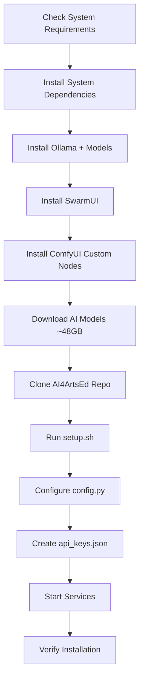
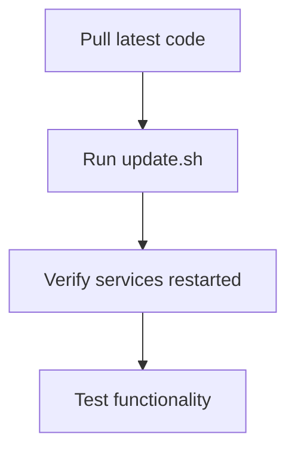

# AI4ArtsEd DevServer - Installation Documentation

Complete installation and configuration documentation for deploying AI4ArtsEd DevServer on production Linux servers.

## Quick Start

### ⚡ Fastest Path: QUICKSTART.md
**Want to install as fast as possible?**

**→ [QUICKSTART.md](QUICKSTART.md) ← Start here!**

**Time:** 55-65 minutes (with model transfer) or 80-100 minutes (fresh download)

---

### 📖 Comprehensive Installation

**For detailed understanding, follow these documents in order:**

1. **[SYSTEM_REQUIREMENTS.md](SYSTEM_REQUIREMENTS.md)** - Check your system meets all requirements
2. **[MODELS_REQUIRED.md](MODELS_REQUIRED.md)** - Understand what models will be downloaded (~77GB)
3. **[INSTALLATION.md](INSTALLATION.md)** - Complete step-by-step installation guide
4. **[CONFIGURATION_GUIDE.md](CONFIGURATION_GUIDE.md)** - Configure for your environment

## Installation Overview

### System Requirements
- **OS:** Ubuntu 22.04+, Fedora 38+, or Arch Linux
- **Hardware:** 16GB+ RAM, NVIDIA GPU (16GB+ VRAM), 350GB+ disk
- **Software:** Python 3.11+, Node.js 20+, NVIDIA drivers (CUDA 12.0+)

### What Gets Installed
- **Ollama** + LLM models (~29GB) - Local inference
- **SwarmUI** + ComfyUI - Image/video generation backend
- **AI Models** (~48GB) - SD3.5, LTX-Video, CLIP encoders
- **AI4ArtsEd Application** - Backend (Flask) + Frontend (Vue)

### Total Installation Time
- **Fast connection (1 Gbps):** ~20 minutes
- **Typical (100 Mbps):** ~90 minutes
- **Slow (10 Mbps):** ~8-12 hours

Most time spent downloading models.

## Helper Scripts

Five helper scripts are provided in the repository root to simplify common tasks:

### check_prerequisites.sh - System Requirements Check
**Run this FIRST before installation!**

**Purpose:** Verifies all system requirements

**What it checks:**
- Disk space (350GB+ required)
- RAM (16GB+ required)
- GPU and VRAM (NVIDIA, 16GB+)
- CUDA version (12.0+)
- Python (3.11+) and Node.js (v20+)
- Ports availability (7801, 7821, 11434, 17801)
- Internet connectivity

**Usage:**
```bash
cd /path/to/ai4artsed_webserver
./check_prerequisites.sh
```

**When to use:** Before installation, to catch issues early

---

### transfer_models.sh - Fast Model Transfer
**NEW! Transfer models from existing installation over LAN**

**Purpose:** Transfer AI models from source server (10-15 min) instead of downloading (45-60 min)

**What it does:**
- Transfers AI models via rsync over LAN
- Progress bar during transfer
- Verifies checksums after transfer
- Creates required symlinks
- **Saves 30-45 minutes!**

**Usage:**
```bash
cd /path/to/ai4artsed_webserver
./transfer_models.sh --source ai4artsed@SOURCE_SERVER

# Custom SwarmUI path
./transfer_models.sh --source ai4artsed@fedora --swarmui /custom/path

# Dry run (preview only)
./transfer_models.sh --source ai4artsed@fedora --dry-run
```

**When to use:** When you have another machine with AI4ArtsEd already installed

**Full documentation:** [MODEL_TRANSFER.md](MODEL_TRANSFER.md)

---

### download_models.sh - Model Downloader
**Download models from HuggingFace (fallback)**

**Purpose:** Downloads all required AI models (~48GB) from HuggingFace

**What it does:**
- Downloads SD3.5 Large, CLIP encoders, LTX-Video, T5 encoder
- Idempotent (skip existing files, safe to re-run)
- Creates required symlinks
- Progress feedback

**Usage:**
```bash
cd /path/to/ai4artsed_webserver
./download_models.sh

# Custom SwarmUI path
SWARMUI_PATH=/custom/path ./download_models.sh
```

**When to use:** Fresh installations or when transfer_models.sh is not available

---

### setup.sh - Initial Setup

**Purpose:** One-time setup after cloning repository

**What it does:**
- Creates Python virtual environment
- Installs Python dependencies
- Creates exports directories
- Builds frontend production bundle

**Usage:**
```bash
cd /path/to/ai4artsed_webserver
./setup.sh
```

**When to use:** After cloning repository, before configuration

---

### install_comfyui_nodes.sh - ComfyUI Custom Nodes Installation

**Purpose:** Automated installation of AI4ArtsEd ComfyUI custom nodes

**What it does:**
- Auto-detects SwarmUI path (or accepts custom path)
- Activates SwarmUI virtual environment
- Clones/updates 3 custom nodes (LTXVideo, ai4artsed_comfyui, sound-lab)
- Installs Python dependencies for each node

**Usage:**
```bash
cd /path/to/ai4artsed_webserver
./install_comfyui_nodes.sh

# Or with custom SwarmUI path:
SWARMUI_PATH=/custom/path/SwarmUI ./install_comfyui_nodes.sh
```

**When to use:** After SwarmUI installation, before AI model downloads

**Full documentation:** [COMFYUI_NODES_HELPER.md](COMFYUI_NODES_HELPER.md)

---

### update.sh - Update System

**Purpose:** Update to latest version from git

**What it does:**
- Pulls latest code from git
- Updates Python dependencies
- Rebuilds frontend
- Restarts systemd services (if configured)

**Usage:**
```bash
cd /path/to/ai4artsed_webserver
./update.sh
```

**When to use:** To update to latest version, after git pull

---

## Documentation Files

### QUICKSTART.md
**Quick installation guide for impatient users**

**Contents:**
- Prerequisites checklist (API keys!)
- Option A: Installation with model transfer (55-65 min)
- Option B: Installation with fresh download (80-100 min)
- Copy-paste command blocks for each step
- Production deployment with systemd
- Troubleshooting quick-fixes
- Timing breakdowns

**When to read:** When you want the fastest path to a working installation

---

### MODEL_TRANSFER.md
**Guide for transferring models between servers**

**Contents:**
- Why transfer instead of download
- SSH setup for model transfer
- Usage examples and options
- Transfer speed comparisons
- Ollama models transfer (optional)
- Troubleshooting transfer issues
- Security considerations

**When to read:** When you have another machine with models already downloaded

---

### SYSTEM_REQUIREMENTS.md
**Complete list of system-level dependencies**

**Contents:**
- Hardware requirements (GPU, RAM, disk)
- Operating system compatibility
- System packages by OS (Ubuntu, Fedora, Arch)
- NVIDIA driver installation
- Node.js requirements
- Port configuration
- Disk space breakdown

**When to read:** Before starting installation, to verify system compatibility

---

### MODELS_REQUIRED.md
**Complete AI model inventory with download links**

**Contents:**
- Ollama models (gpt-OSS:20b, llama3.2-vision)
- SD3.5 Large model (16GB)
- CLIP text encoders (6GB)
- LTX-Video model (15GB)
- T5 encoder for video (11GB)
- Download commands and checksums
- Installation paths
- Verification scripts

**When to read:** Before downloading models, to understand disk space and time requirements

---

### INSTALLATION.md
**Complete step-by-step installation guide**

**Contents:**
- Prerequisites check
- System dependencies installation
- Ollama installation + models
- SwarmUI installation
- ComfyUI custom nodes
- AI model downloads
- Application setup
- Configuration
- Service setup (systemd)
- Starting services
- Verification
- Troubleshooting

**When to read:** During installation - follow step-by-step

---

### CONFIGURATION_GUIDE.md
**Complete configuration reference**

**Contents:**
- Main configuration (config.py)
- API keys setup (api_keys.json)
- Environment variables (.env)
- UI modes (kids, youth, expert)
- Safety levels (kids, youth, adult, off)
- Model configuration (per-stage LLM selection)
- Port configuration
- Path configuration
- Advanced settings
- Configuration examples
- Troubleshooting

**When to read:** After installation, when configuring for your environment

---

### SOFTWARE_VERSIONS.md
**Quick reference for all software versions and repository URLs**

**Contents:**
- Backend versions (Python, Flask, dependencies)
- Frontend versions (Vue 3.5.22, Vite 7.1.11, etc.)
- External services (Ollama, SwarmUI)
- ComfyUI custom nodes with correct GitHub URLs
- AI model sources and versions
- System requirements summary
- Version verification commands
- Update strategy

**When to read:** When verifying installations, updating components, or troubleshooting version issues

---

## Deployment Workflow

### First-Time Installation



### Updates



---

## Installation Paths

### Recommended Structure
```
/opt/ai4artsed/
├── SwarmUI/                       # SwarmUI installation
│   ├── Models/                    # AI models (70-100GB)
│   └── dlbackend/ComfyUI/         # Integrated ComfyUI
│
└── ai4artsed_webserver/           # Git clone of main repo
    ├── devserver/                 # Backend application
    │   ├── config.py              # Main configuration
    │   └── api_keys.json          # API keys (gitignored)
    ├── public/ai4artsed-frontend/ # Frontend application
    ├── venv/                      # Python virtual environment
    ├── exports/                   # Generated media
    ├── setup.sh                   # Setup helper script
    └── update.sh                  # Update helper script
```

---

## Common Tasks

### Start Services Manually
```bash
# Terminal 1: SwarmUI
cd /opt/ai4artsed/SwarmUI
./launch-linux.sh

# Terminal 2: Backend
cd /opt/ai4artsed/ai4artsed_webserver/devserver
source ../venv/bin/activate
python3 server.py
```

### Start Services with Systemd
```bash
sudo systemctl start ai4artsed-swarmui
sudo systemctl start ai4artsed-backend

# Check status
sudo systemctl status ai4artsed-backend
```

### View Logs
```bash
# Systemd logs
sudo journalctl -u ai4artsed-backend -f

# Application logs (if configured)
tail -f /opt/ai4artsed/data/logs/backend.log
```

### Update System
```bash
cd /opt/ai4artsed/ai4artsed_webserver
./update.sh
```

### Verify Installation
```bash
# Check all services running
curl http://localhost:11434/api/tags     # Ollama
curl http://localhost:7801/API/GetNewSession  # SwarmUI
curl http://localhost:17801/              # Backend

# Check models exist
ls -lh /opt/ai4artsed/SwarmUI/Models/Stable-Diffusion/OfficialStableDiffusion/
ls -lh /opt/ai4artsed/SwarmUI/dlbackend/ComfyUI/models/clip/
```

---

## Troubleshooting

### Quick Diagnostics
```bash
# Check system requirements
nvidia-smi                    # GPU + CUDA
df -h /opt                    # Disk space
free -h                       # RAM
python3 --version             # Python
node --version                # Node.js

# Check services
systemctl status ollama
systemctl status ai4artsed-swarmui
systemctl status ai4artsed-backend

# Check ports
sudo lsof -i :7801,7821,11434,17801
```

### Common Issues

**See detailed troubleshooting sections in:**
- [INSTALLATION.md - Troubleshooting](INSTALLATION.md#troubleshooting)
- [CONFIGURATION_GUIDE.md - Troubleshooting](CONFIGURATION_GUIDE.md#troubleshooting)
- [MODELS_REQUIRED.md - Troubleshooting](MODELS_REQUIRED.md#troubleshooting)

---

## Getting Help

- **Check Documentation:** Read through the four main docs
- **Search Issues:** https://github.com/joerissenbenjamin/ai4artsed_webserver/issues
- **Create Issue:** If problem persists, open a new issue with:
  - System info (`nvidia-smi`, `python --version`, OS version)
  - Error messages from logs
  - Steps to reproduce

---

## For Developers

### Development Setup
```bash
# Clone repository
git clone https://github.com/joerissenbenjamin/ai4artsed_webserver.git
cd ai4artsed_webserver

# Run setup
./setup.sh

# Configure
cp devserver/config.py devserver/config.py.backup
nano devserver/config.py  # Edit PORT to 17802 for dev

# Start development servers
# Terminal 1: Backend
cd devserver
source ../venv/bin/activate
python3 server.py

# Terminal 2: Frontend
cd public/ai4artsed-frontend
npm run dev  # Vite dev server on port 5173
```

### Making Changes
```bash
# Edit files
# Test locally

# Commit
git add .
git commit -m "Description of changes"
git push origin your-branch

# Update production
ssh production-server
cd /opt/ai4artsed/ai4artsed_webserver
git pull origin main
./update.sh
```

---

## Additional Resources

- **Main Project Docs:** `/docs/` (architecture, decisions, devlogs)
- **OpenRouter API:** https://openrouter.ai/docs
- **Ollama Models:** https://ollama.com/library
- **SwarmUI:** https://github.com/mcmonkeyprojects/SwarmUI
- **ComfyUI:** https://github.com/comfyanonymous/ComfyUI

---

## Document Updates

This documentation was created on 2025-01-27 for the git-pull deployment system.

**Last Updated:** 2025-01-27
**Version:** 1.0.0
**Maintainer:** Prof. Dr. Benjamin Jörissen
